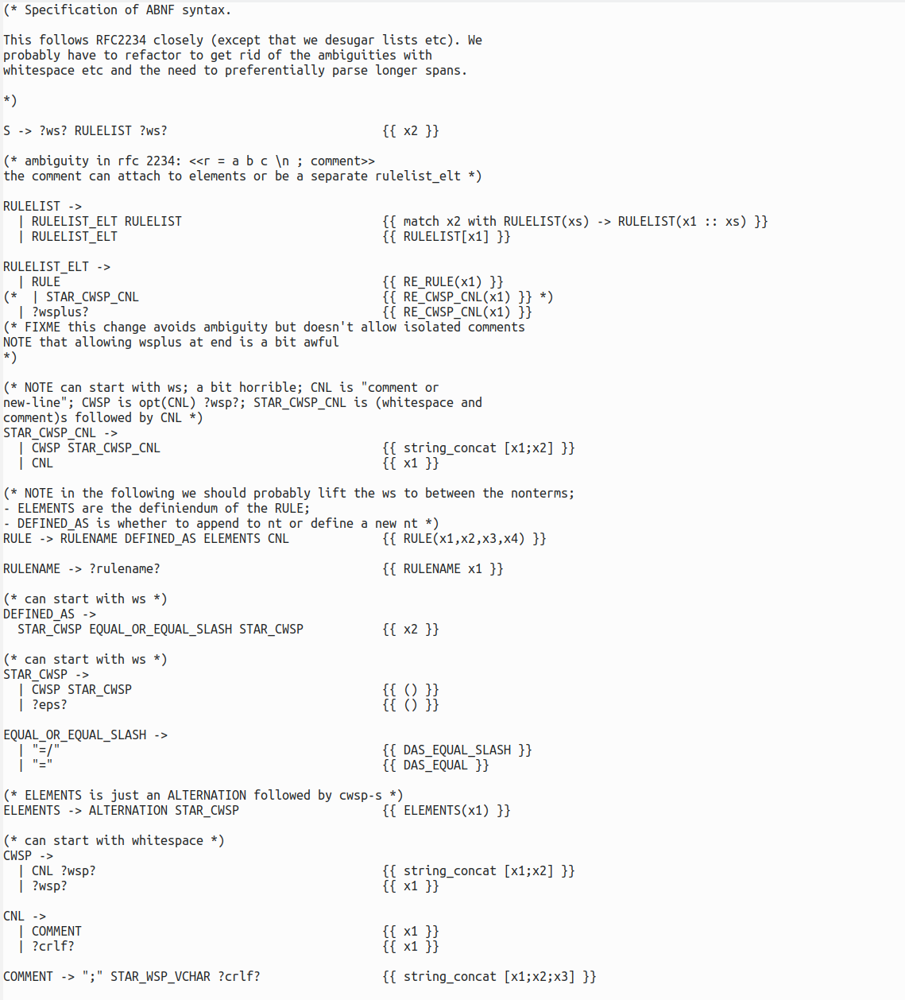
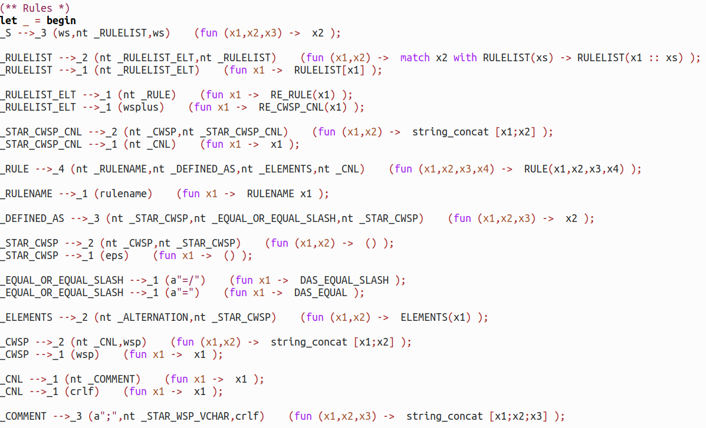
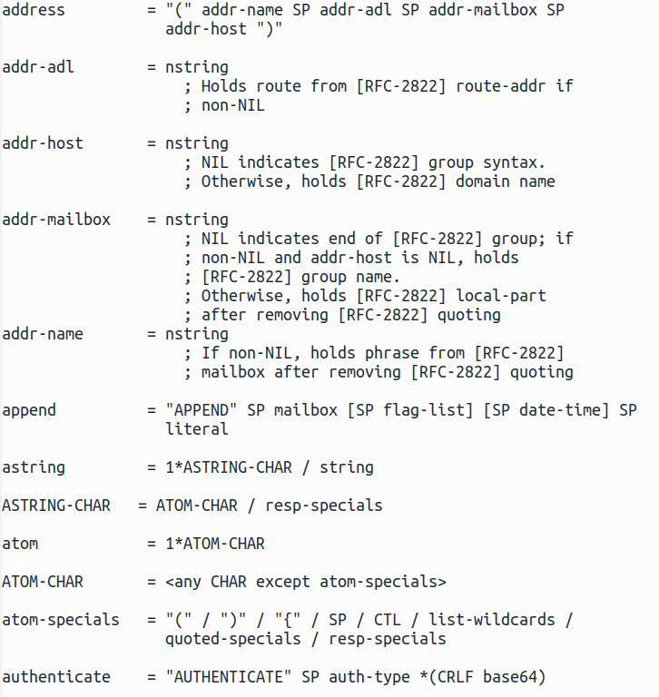

# example_grammars

## Introduction

This repository contains examples to supplement the main parsing libraries I work on.

## Quick links

* P0 parser at <https://github.com/tomjridge/p0/>
* Earley parser at <https://github.com/tomjridge/tjr_simple_earley>
* ocamldoc for these examples at <http://tomjridge.github.io/example_grammars/>

## Install

Probably easiest via opam, with something like:

~~~
opam install -y dune ocamlfind odoc
opam pin add -y -n p0_lib https://github.com/tomjridge/p0.git#dev
opam pin add -y -n example_grammars https://github.com/tomjridge/example_grammars.git
opam install -y p0_lib example_grammars
~~~

## P0, ABNF example

At the moment, the main example is a sequence of P0 parsers. The first implements a parser for "Plain BNF". Subsequent parsers culminate in a parser for  the IMAP protocol. 

Briefly, we parse a specification of ABNF (almost directly from the RFC!), and **generate** an ABNF parser generator. We then use *this* to parse the IMAP grammar (directly from the RFC!), and in turn use this to generate an IMAP protocol parser. We can then use *this* to parse IMAP protocol messages. So, rather convoluted... but this is mainly to demonstrate the flexibility of the underlying techniques. And hopefully, the IMAP parser will conform to the spec "by construction".

See <./src/README.md> for further details. 

A fragment of the ABNF specification (adapted from the RFC) is:

A fragment of the generated ABNF parser is:

A fragment of the IMAP grammar (from the RFC) used to generate the IMAP parser, is:

